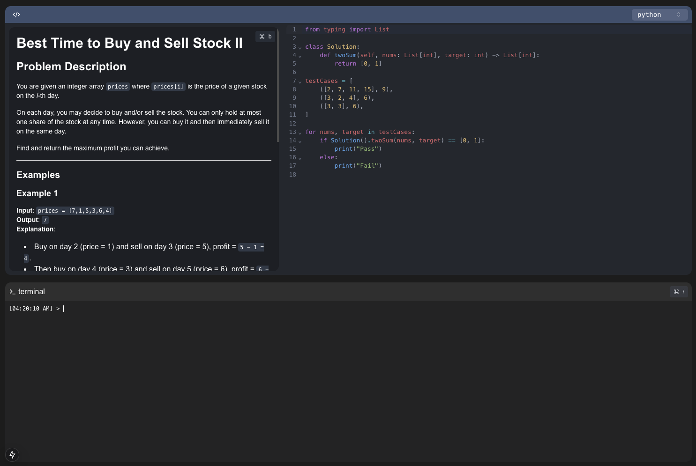

# Engine (WIP)
Rolling my own leetcode cuz I'm tired of doing actual leetcode problems.
This project is being actively developed on.



## Goals
- Easily deploy offline and practice via docker compose
- Duolingo style design
  - Streaks + Friend Streaks
  - Easy to select individual problems or a category of problems
  - Easy to select individual problems or a category of problems
  - Easy to just find a new problem to work on or review weak areas
- Fast execution with low latency

## Quick Start
Start the client
```bash
cd client
pnpm install
./local/run-dev.sh
```

Start the server
```bash
cd server
./local/run-dev.sh
```


